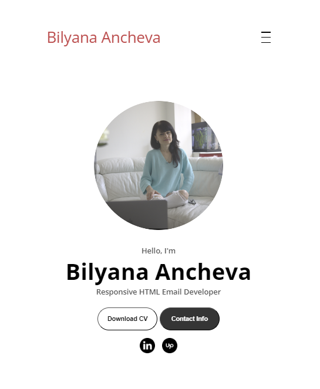
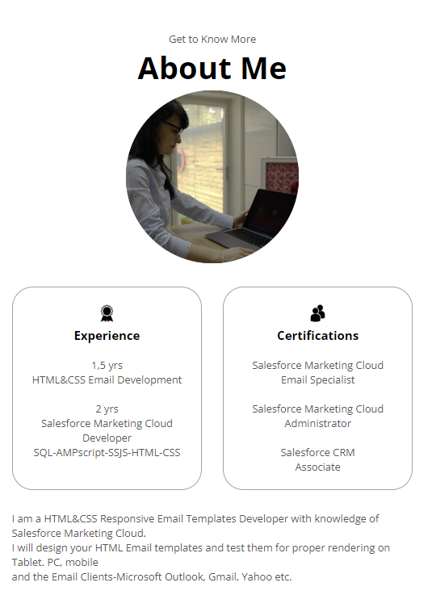
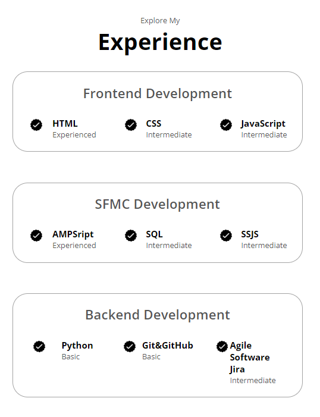
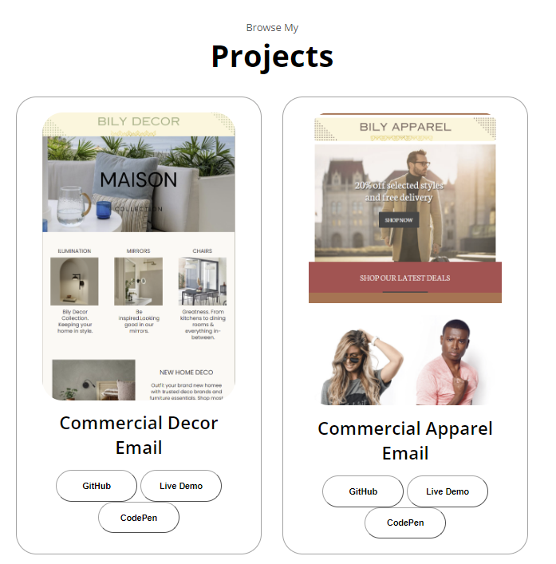
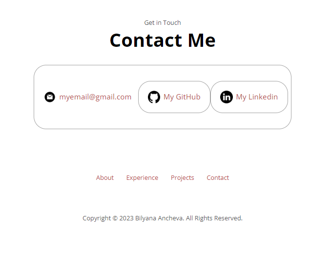

# I am Bilyana Ancheva, 
and I would like to welcome you to my GitHub Portfolio.

## Introduction

I am a Salesforce Marketing Cloud Engagement Email Specialist (4x Salesforce certified) and Full-Stack Developer (Full-stack Developer hands-on) 

With advanced level of English, I will bring to your company invaluable soft skills because I've worked in Agile and Scrum environments and come from the B2B corporate world.

I combine Frontend and Backend coding skills(HTML, CSS, Javascript, NodeJS, Angular) and Salesforce Marketing Cloud Engagement expertise 

### If you are interested to work with me, 
the best bet is to hit me up on Linkedin: https://www.linkedin.com/in/bilyana-ancheva/

## Skills
- Programming Languages: HTML5, CSS3, Javascript, Java, NodeJS, Angular
  
- Python Programming series: 
- [Crash Course on Python](https://www.coursera.org/account/accomplishments/verify/AYQUHSPKNFQK) Coursera Certificate
- [Python to Interact with the Operating System](https://www.coursera.org/account/accomplishments/verify/856BECU7X4KB) - Coursera certificate
- [Google Automation with Python](https://www.coursera.org/account/accomplishments/professional-cert/ZXMM25G67E73)
- Preprocessors: SCSS
- CI/CD, GitHub Actions
- Version Control & Management: [Git and Github](https://www.coursera.org/account/accomplishments/verify/FCTQU2NWDZKY) - Coursera certificate
- Frameworks and libraries: Bootstrap
- Front-End Developer Frameworks: React, Angular
- IDE/Code Editors: Visual Studio Code, IntelliJ, Codepen, Repl.it
- API Testing Tools: Postman
- Containerization Systems: Docker
- Salesforce Marketing Cloud programming languages: AMPSCRIPT, SSJS, SQL Quieries, GTL

## Projects
## Salesforce Marketing Cloud Engagement - Automated Hotel Room Reservation email marketing Project
1. PDF attached [Hotel chain room reservation email marketing journey with Salesforce Marketing Cloud ](https://docs.google.com/document/d/1y4pysHwzjPEv5XMY_TQUNku78HB7yFqIgRu2IDwqAWU/edit?usp=sharing)
## Project Scope
This project document describes the reservation and communication system implemented by MOA Hotels, a global hotel company. The system involves targeted email marketing, multilingual emails, timely reminders, and robust automation implemented on Salesforce Marketing Cloud Engagement platform. It provides an overview of the key functionalities and processes.

## Areas Implied
Rest API usage and Testing with Postman, Journey Builder, Relational data model, SQL, AMPSCRIPT Lookup, Date and Currency transformations, Cloudpage, SQL.

## MOA Hotels Presence and Market
- MOA Hotels operates globally but markets exclusively in certain countries: France, Portugal, Spain, Canada, USA, Germany, United Kingdom, Russia.

## Reservation Process and Email Communication
- API calls capture reservation and user data on the website.
- Email communication includes a dynamic initial email, language and currency conversion, and a "confirm reservation" link.
- In case of a bounced email, a task in Salesforce CRM is created.

## Unconfirmed Reservations Handling
- Tasks or emails are triggered based on the time remaining for unconfirmed reservations.
- If less than one month remains, a Salesforce CRM task is created.
- If more than one month remains, a periodic email with a Cloudpage link for date modification is sent until the reservation is confirmed.
- Less than 48 hours before the stay, a reminder email is sent with additional experiences.

## Email Timing and Cancellation Checks
- Emails are sent at specific time slots, with the first one at 9:00 in the morning.
- Reservations are checked for cancellation daily at 02:00 on Salesforce Marketing Cloud FTP.

## Automated Tracking and Data Export
- Tracking of communication shipments, openings, and clicks is automated.
- Data from the previous day's shipments is exported to Marketing Cloud SFTP at 8:00 in the morning daily.

## Reservation Statistics Automation
- An automation is implemented to load total reservations, valid reservations, and canceled reservations into a table for daily consultation by the marketing team.
## Project 2: Insurance Industry Use Case
[Vet Clinic Salesforce Sales and Service Cloud setting up and custom objects personalization](https://github.com/ba23-python/SQL-Assignment/blob/main/Portfolio-EN-insurance%20project%20-Bilyana-Ancheva%20(2).pdf)

## Project 3: Salesforce Sales and Service Cloud
[Vet Clinic Salesforce Sales and Service Cloud Business Analysis Requierements Gathering](https://docs.google.com/document/d/15Rx7TJdEe9XHjmrOKyJPMjWXtwwsWQ0qIp5GDzUjlWM/edit?usp=sharing)

[Vet Clinic Salesforce Sales and Service Cloud setting up and custom objects personalization](https://docs.google.com/document/d/15Rx7TJdEe9XHjmrOKyJPMjWXtwwsWQ0qIp5GDzUjlWM/edit?usp=sharing)

## FrontEnd Development portfolio
## Project 3: [My Personal Responsive Frontend landing page development(mock project)](https://github.com/ba23-python/bilyanaancheva.github.io)
   

## Project 4: [Responsive Forms and Registrations](https://github.com/ba23-python/UpgradeHub/tree/master/Responsive%20Forms%20and%20Registrations)

## I am fluent in English. Watch me speaking in English on the [Youtube channel of MOA (Marketing Online Academy)](https://www.youtube.com/watch?v=u8LV0w3HrDI)

### If you are interested to work with me, 
the most reliable option is to contact me through Linkedin: https://www.linkedin.com/in/bilyana-ancheva/

Email address: bela.energetica@gmail.com

